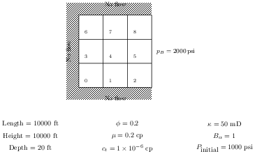

# Homework Assignment 16

[](https://travis-ci.com/PGE323M/assignment16)

## Instructions

The [Simple 2D Problem in CMG](https://youtu.be/4UGY74SJZ-o) was also the exact problem we wrote our own Python code for in [Assignment 15](https://github.com/PGE323M-Fall2017/assignment15/blob/master/assignment15.ipynb).   Recall the problem schematic



Work through the [tutorial](https://youtu.be/4UGY74SJZ-o) and import your results into CMG's Results 3D application.  From there, export the pressures as shown in the tutorial, but this time export them at the **end of day 2**.
Save the exported results to a file `assignment16.txt`.  Copy this file into this repository, add, commit, and push to Github for submission.

## Testing

If you would like to check to see if your solution is correct, run the following command at the Terminal command line:

```bash
>nosetests
```
